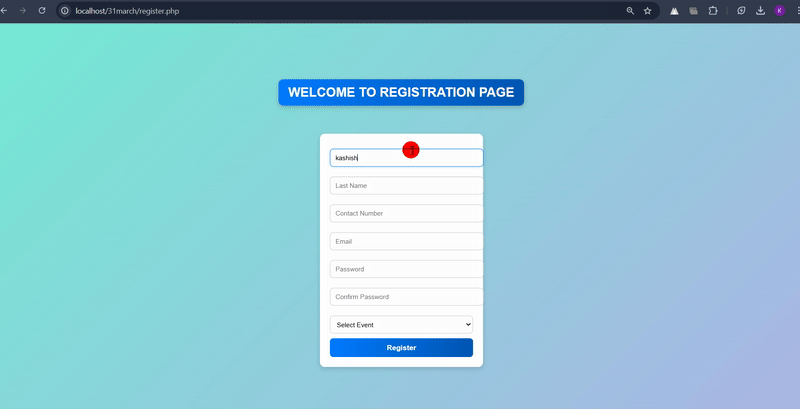

# 23BCA10293_PHP_PROJECT

Event Management System (EMS) - Advanced Web Application
This Event Management System (EMS) is a modern PHP-powered web application that allows users to register, authenticate, and manage profiles with ease. Designed with user-friendly interactions, the system ensures a seamless experience for users to participate in events, manage profiles, and communicate effectively. It also includes enhanced security, validation standards, and real-time notifications for an optimized experience.

Key Features:
1. User Registration
Users can register quickly through an easy-to-follow process:

Personal Information:

First Name, Last Name

Date of Birth (for age verification)

Contact Information:

Phone Number (with validation)

Email Address (proper format check)

Password & Security:

Password, Confirm Password

Password strength checker (minimum 8 characters, at least one uppercase, one number, one special character)

Event Selection:

Dropdown with a wide variety of event categories such as Dance, Music, Poetry, Art, Sports, Workshops, etc.

Terms & Conditions:

A checkbox for accepting terms and privacy policy before submitting.

Email Verification:

An email verification step after registration to confirm authenticity.

2. User Login
Secure login options:

Login Credentials:

Email and Password.

Security:

Implement Two-Factor Authentication (2FA) using email or SMS.

Session Management:

Password recovery option.

“Remember me” feature for easier future logins.

Error handling and validation for invalid login attempts.

3. Home Page & Dashboard
Once logged in, users are redirected to their personalized dashboard:

Profile Overview:

Display profile information like Name, Contact, Email, Registered Events, etc.

Upload Profile Picture for personalization.

Event Participation:

List of upcoming events the user has registered for.

Quick access to RSVP for new events.

Notifications:

Real-time notifications for event updates (e.g., event cancellation, time changes).

Event Recommendations:

AI-based event suggestions based on user interests and past event participation.

4. Event Management
Event Details:

Users can browse through detailed event pages with descriptions, dates, locations, and participant limits.

RSVP Options:

Register for multiple events at once.

Manage event participation by cancelling or modifying registration.

Ticketing System (Optional):

Users can purchase event tickets and download them as PDFs.

5. Admin Panel
The Admin has full control over the system:

User Management:

View, edit, or delete user profiles.

Reset passwords, block/unblock users.

Event Management:

Create, edit, or delete events.

Monitor user registrations for each event.

Reporting & Analytics:

View user activity, event participation stats, and user engagement analytics.

6. Security & Validation
Encryption:

Passwords are stored securely using bcrypt hashing.

Data Validation:

Server-side validation for all inputs (registration, login, profile update).

Session Security:

Secure sessions with token-based CSRF protection.

Automatic logout after inactivity for 30 minutes.

Technology Stack:
Frontend: HTML5, CSS3, JavaScript (with jQuery and Bootstrap for responsive design)

Backend: PHP (OOP)

Database: MySQL

Server Environment: XAMPP / WAMP / Apache

Email & SMS Service: PHPMailer for emails, Twilio (optional) for SMS-based 2FA

Version Control: Git (for easy collaboration and code management)

Security: HTTPS, CSRF Protection, Data Sanitization

How to Set Up & Run:
Local Setup:
Clone the repository:

bash
Copy
git clone https://github.com/your-repo/ems.git
Install the prerequisites:

Install XAMPP or WAMP on your local machine.

Start the Apache and MySQL servers.

Database Setup:

Import the ems_database.sql file into your local MySQL server using phpMyAdmin or MySQL Workbench.

Configure the application:

Set up the database connection in the config.php file, providing your database credentials.

Set up email configuration for verification and notifications (using SMTP in PHPMailer).

Run the Application:

Open your browser and navigate to http://localhost/ems to view the homepage.

Production Setup:
Deploy the Application:

Upload the project files to your web hosting server.

Update database configuration with your live server credentials.

Set up SSL (HTTPS) for security.

Setup Cron Jobs:

Schedule email notifications, password reset tasks, and other recurring actions using cron jobs.

Future Improvements:
Event Search & Filters:

Implement search functionality with filters like location, date, type, and more for event discovery.

User Reviews & Ratings:

Users can leave reviews and ratings for events they participated in.

Real-Time Chat:

A real-time chat feature for users to interact with event organizers and other participants.

Mobile Application:

Develop a companion mobile app for iOS and Android to extend functionality and improve user engagement.

Conclusion:
This advanced Event Management System provides users with a smooth and secure platform to register, authenticate, and manage their profiles for various events. The system is scalable, highly customizable, and equipped with all necessary tools to manage events effectively while maintaining security standards. It is an ideal choice for handling small to large-scale events with ease.

